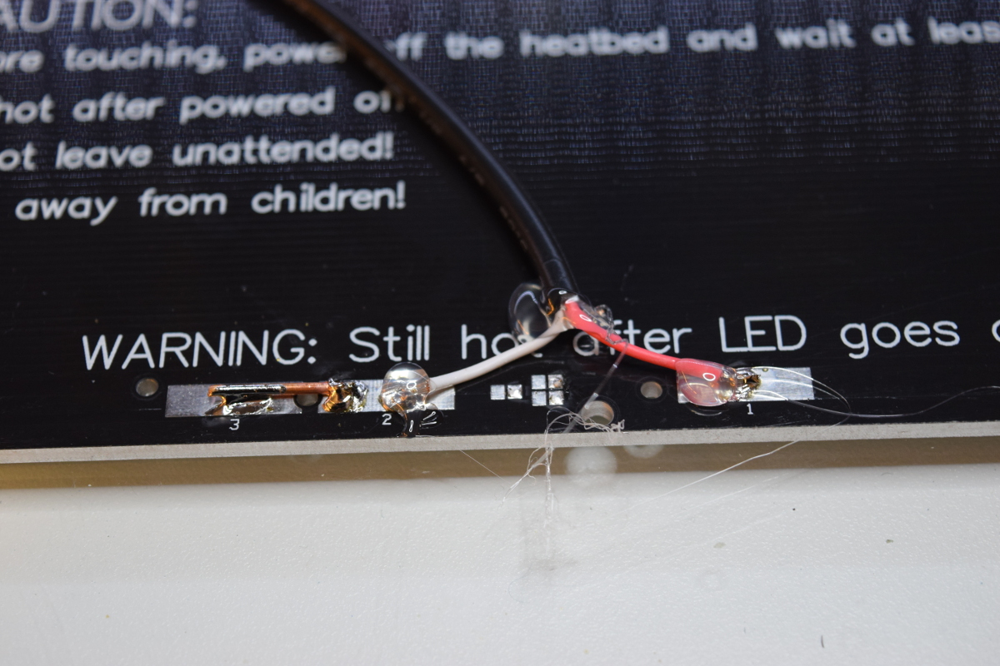
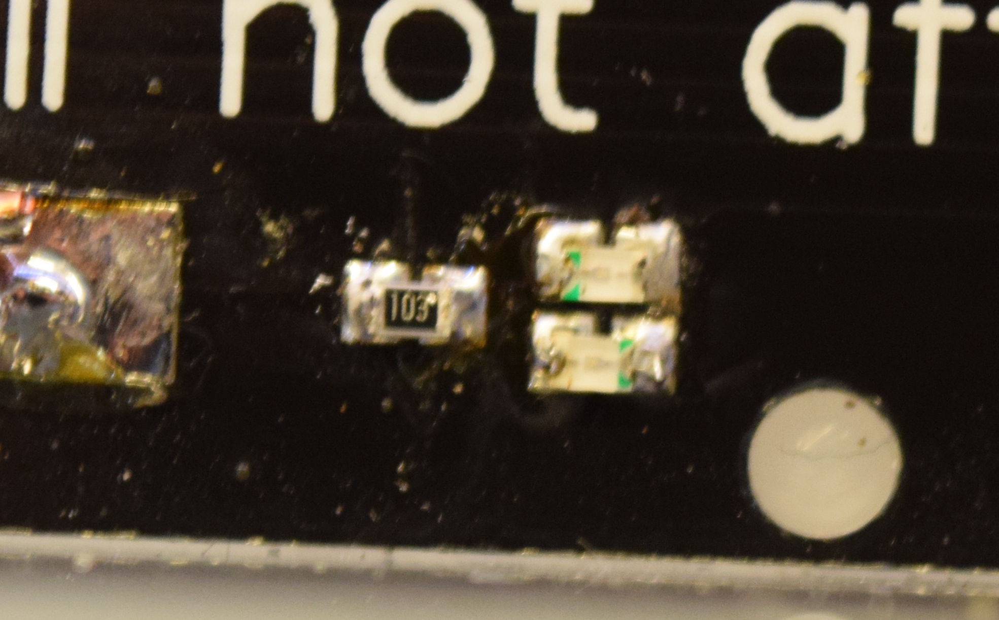

# Heating plate

## Connecting the plate

The heating plate is a standard MK3 plate used in 3D printers. It is a square of 214 mm of side.

It is composed on 2 resistors of 2.4 Ω and there are 2 ways to connect them:

- in serie : you have a resistor of 4.8 Ω and this will be used to power in 24 V
- in parallel : you have a resistor of 1.2 Ω and this will be used when powerred in 12 V

In our case we will power the plate in 12 V and we will connect them in parallel. See the picture for more information.

:::tip
It is also important to put 2 LEDs (just to be sure one of them turn on even if you power the plate in the opposite way)
and a resistor of 1 kΩ (10 kΩ would give a much less bright light).

This will allow to see when the plate is turned on. Nice to debug!
:::

With a resistance of 1.2 Ω in 12 V we will need 10A. This is the limit of the powersupply and it would be nice if
we don't use permanently full power.

Note that the Board is operating at 3V3 and the PID is powered in 12 V. Thus the PowerFET used to deliver the required
current must be picked up carefully to have a low threshold voltage Vgs and a low Rds channel resistance at this
operating 3v3 voltage. Good matches are provided [here on Mouser](http://www.mouser.ch/Semiconductors/Discrete-Semiconductors/Transistors/MOSFET/_/N-ax1sf?P=1z0yra8Z1z0y182Z1z0z7ptZ1yzxnagZ1yw76g4Z1yw76ckZ1yw76gb&Rl=ax1sfZgjdhsdZ1yjepp1Z1yjenlnSGTax1sfZgjdhp3Z1yw78huZ1y9kq41SGT&Keyword=MOSFET&OrgTerm=mosfet&FS=True&Ns=Pricing|0).

We have chosen the [IPB80N03S4L-03](https://www.infineon.com/dgdl/Infineon-IPB80N03S4L-03-DataSheet-v02_01-EN.pdf?fileId=5546d4626cb27db2016ccd4c03921b4c) for its steady Rds (3.4 mOhm max.) at low Vgs (Vgs(th) 1.6 V typ.) even for high currents (up to 80A).

## Limit values

In order to be able to heat the following conditions have to be met:

- PCB temperature probe (one-wire) must be working and the temperature must be between 10 and 70 °C
- Liquid temperature probe (one-wire) must be connected and the temperature must be between 10 and 60 °C

The maximal power is 80% of full power that corresponds to around 8 A.

The following parameters are define in _PIDThread.cpp_

- SAFETY_MAX_PCB_TEMP 7000
- SAFETY_MIN_PCB_TEMP 1000
- SAFETY_MAX_LIQ_TEMP 6000
- SAFETY_MIN_LIQ_TEMP 1000
- PID_OUTPUT_LIMIT 200

## Enabling heating

In order to turn on the heating you should check the following parameters:

- A - The liquid temperature on the top. It should be between 1000 and 6000 (10 °C to 60 °C)
- B - The liquid temperature on the bottom. It should be between 1000 and 6000 (10 °C to 60 °C)
- C - The temperature of the PCB (Printed Circuit Board). It should be between 1000 and 7000
- E - The target temperature. It should be between 1000 and 6000 (10 to 60°C)
- FLAG_PID_CONTROL - The PARAM_STATUS bit FLAG_PID_CONTROL should be 1

The heating will also depend of the status of the weight.

## Disabling heating

Here are the important parameters:

| ID  | P   | NAME                          | DESCRIPTION                                                         |
| --- | --- | ----------------------------- | ------------------------------------------------------------------- |
| 0   | A   | PARAM_TEMP_EXT1               | Temperature of the solution (top)                                   |
| 1   | B   | PARAM_TEMP_EXT2               | Temperature of the solution (bottom)                                |
| 2   | C   | PARAM_TEMP_PCB                | Temperature of the PCB                                              |
| 4   | E   | PARAM_TEMP_TARGET             | Target temperature of the liquid (in °C)                            |

:::tip
In order to disable heating just put at target temperature for the board of 0 (write in the console `E0` and press <kbd>Enter</kbd>).
:::
